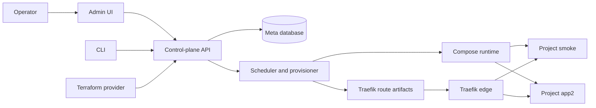

# Architecture

Supadupa has two major layers:

- The control plane that accepts operator intent, stores platform state, and exposes Admin UI/API workflows.
- Project runtimes that run isolated Supabase-style stacks for each project.

## Control Plane

The control plane owns:

- Authentication and operator sessions.
- Organization, user, and access state.
- Project desired state.
- Platform defaults.
- Backup target metadata.
- Route manifest generation.
- Provisioning orchestration.
- API, CLI, and Terraform surfaces.

## Project Runtime

Each project is isolated by runtime assets such as directories, networks, secrets, routes, and service containers. A full-profile project can expose:

- API.
- Studio.
- Postgres.
- Transaction pooler.
- Session pooler.
- Storage.
- Realtime.
- Edge Functions.
- Logs and analytics services.

## MVP Runtime Boundary

Docker Compose is the primary MVP runtime. Kubernetes manifests and CRDs exist, but the Kubernetes path should be documented as experimental until operational proof catches up with the Compose path.

## Related Docs

- [Routing](./routing.md)
- [Projects](./projects.md)
- [Resources](./resources.md)
