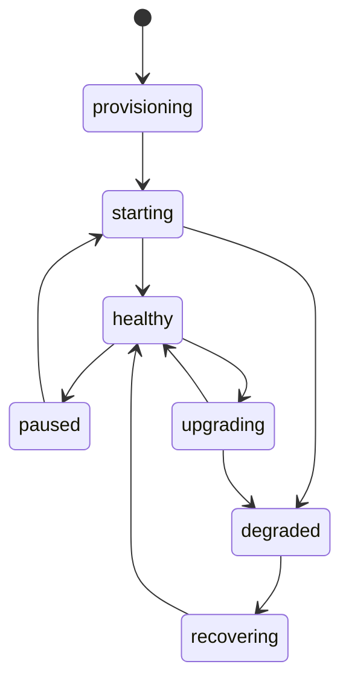

# Projects

A Supadupa project is an isolated Supabase-style runtime with its own ref, routes, credentials, stack version, profile, resource settings, and operational state.

## Project Lifecycle

Project creation is asynchronous. The API returns quickly with status `provisioning`; the scheduler then converges runtime state in the background.

## Important Fields

- `ref`: stable project identifier used in routes and resource names.
- `name`: display name.
- `org`: owning organization.
- `stack version`: Supabase stack release selected for the project.
- `profile`: service set such as a full runtime.
- `status`: current operational state.

## Admin UI Workflow

## Related Docs

- [Admin UI projects](../admin-ui/projects.md)
- [Resources](./resources.md)
- [Upgrades](../operations/upgrades.md)
