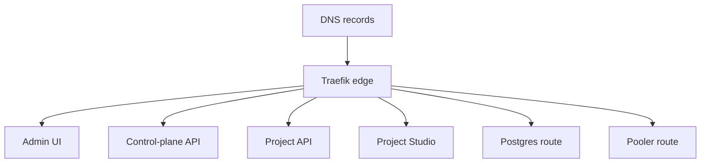

# Routing

Supadupa uses separate DNS patterns for the control plane and project surfaces.

Recommended shape:

```text
admin.example.com
api.example.com
*.apps.example.com
```

For a project with ref `smoke`, Supadupa generates routes such as:

```text
https://smoke.apps.example.com
https://studio-smoke.apps.example.com
https://storage-smoke.apps.example.com
db-smoke.apps.example.com:5432
pooler-smoke.apps.example.com:6543
```

Only Traefik publishes public HTTP/TLS/Postgres ports. Project containers should not be directly host-published.



## Route Sources

Routes come from platform defaults, project configuration, generated route manifests, and optional custom-domain configuration.

## Public Database Routes

:::warning
Open database and pooler ports only when the environment intentionally supports external database access. Host port binds are not the whole security model; Traefik route configuration and per-project ingress settings also matter.
:::

## Related Docs

- [DNS and TLS](../operations/dns-tls.md)
- [VPS quickstart](../quickstart/vps-dns-tls.md)
